<p align="center">
  <picture>
    <source media="(prefers-color-scheme: dark)" srcset="src/renderer/src/assets/icons/app-icon-dark.svg">
    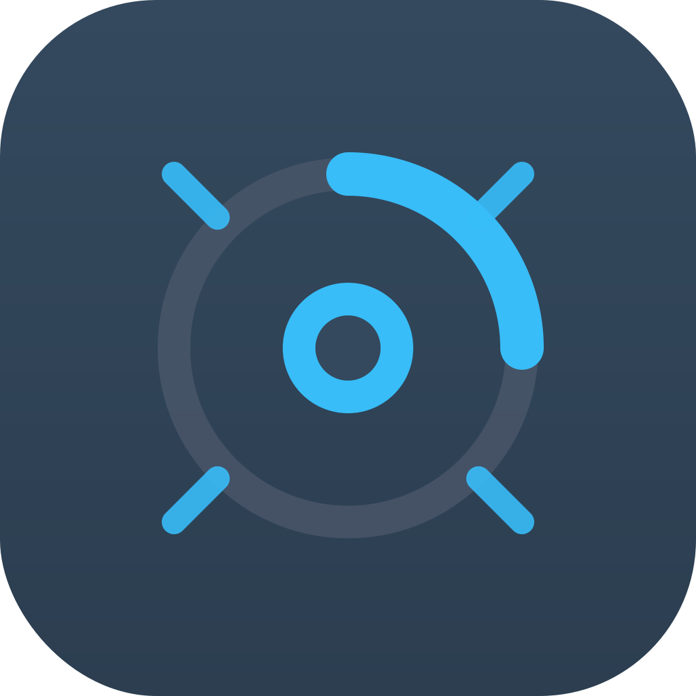
  </picture>
  <h1 align="center">Revel</h1>
  <p align="center">A Fluent Design GUI for <a href="https://github.com/tw93/Mole">Mole CLI</a> — system cleanup, analysis, and optimization, beautifully reimagined.</p>
</p>

<p align="center">
  <a href="https://github.com/a1121611810/revel">
    
  </a>
  <a href="https://github.com/a1121611810/revel">
    
  </a>
  <a href="https://github.com/a1121611810/revel">
    
  </a>
  <a href="https://github.com/a1121611810/revel">
    
  </a>
  <a href="https://github.com/a1121611810/revel">
    
  </a>
  <a href="https://github.com/a1121611810/revel">
    
  </a>
</p>

<div align="center">

[🇬🇧 English](#english) · [🇨🇳 中文](#chinese)

</div>

---

<a name="english"></a>

## 🇬🇧 English

**Revel** is a desktop application that wraps [Mole CLI](https://github.com/tw93/Mole) in a native-like, Fluent Design interface. It makes system maintenance on macOS intuitive and visually pleasing — no terminal required for everyday cleanup, analysis, and optimization tasks.

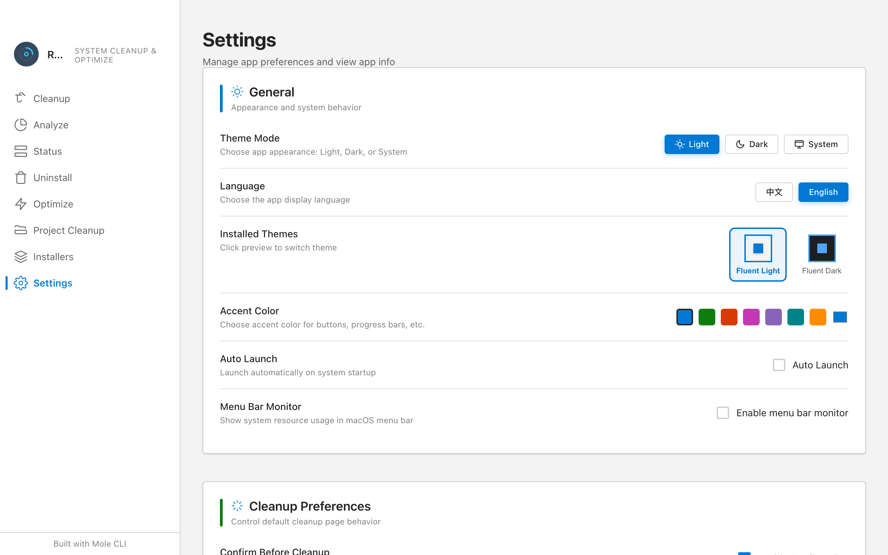

### Features

| Module | Description | Mole Command |
|--------|-------------|--------------|
| **Cleanup** | Scan and clean system caches, build artifacts, and temporary files | `mo clean` |
| **Analyze** | Visual disk space analysis with interactive pie charts | `mo analyze` |
| **Status** | Real-time system monitoring — CPU, memory, disk, battery, network, GPU | `mo status` |
| **Uninstall** | Uninstall applications and their associated files | `mo uninstall` |
| **Optimize** | Run system optimization tasks (DNS flush, memory purge, permissions repair, etc.) | `mo optimize` |
| **Project Cleanup** | Clean build artifacts and dependencies from development projects | `mo purge` |
| **Installers** | Find and delete downloaded installer packages (.dmg, .pkg) | `mo installer` |

### Prerequisites

- **macOS** — Mole CLI is macOS-only (Revel has cross-platform support planned)
- **Node.js 18+** and **pnpm** (package manager)
- **Mole CLI** installed:

  ```bash
  brew install tw93/tap/mole
  ```

### Quick Start

```bash
# Install dependencies
pnpm install

# Start development mode (Vite dev server + HMR + Electron)
pnpm dev

# Build for production
pnpm build

# Package macOS app (DMG + ZIP)
pnpm build:mac
```

Build outputs are placed in `dist/`, and packaged releases in `release/`.

### Architecture

```
Main Process (main.js)
├── Window management (BrowserWindow)
├── System tray (Tray)
├── IPC communication (ipcMain)
├── Command execution (child_process.spawn)
└── Privilege escalation (osascript sudo)

Renderer Process (Vue 3 App)
├── 9 views (Welcome, Clean, Analyze, Status, …)
├── Custom theme engine (themes/engine.js)
├── Fluent Design CSS system (style.css)
└── IPC calls via secure bridge (window.electronAPI)

Preload Script (preload.js)
└── Secure context bridge (contextBridge)
```

The project uses **three independent Vite configs** — no `electron-vite` wrapper:

- `vite.renderer.config.js` — Renderer dev server + HMR
- `vite.main.config.js` — Main process (library mode, CJS, Node 24)
- `vite.preload.config.js` — Preload script (library mode, CJS)

### Screenshots

| Cleanup | Disk Analysis | System Status |
|---------|--------------|---------------|
| 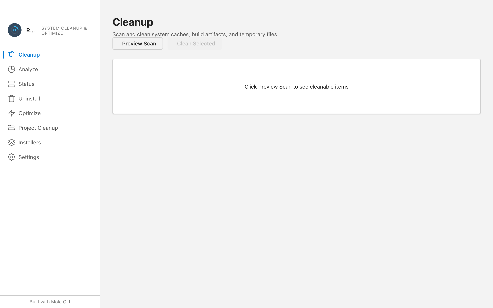 | 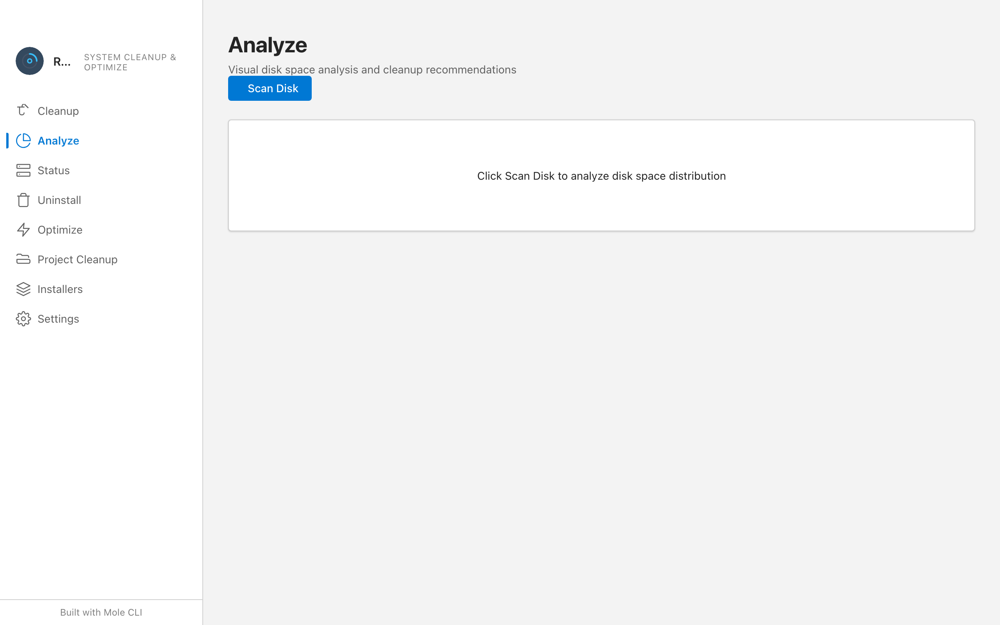 | 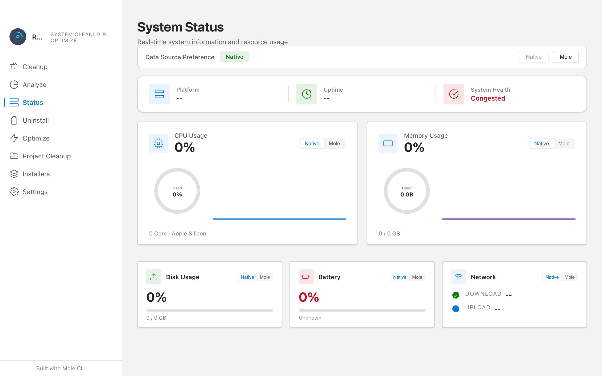 |
| One-click system cache cleanup | Visual disk space analysis | Real-time resource monitoring |

| App Uninstall | System Optimize | Project Cleanup |
|--------------|----------------|-----------------|
| 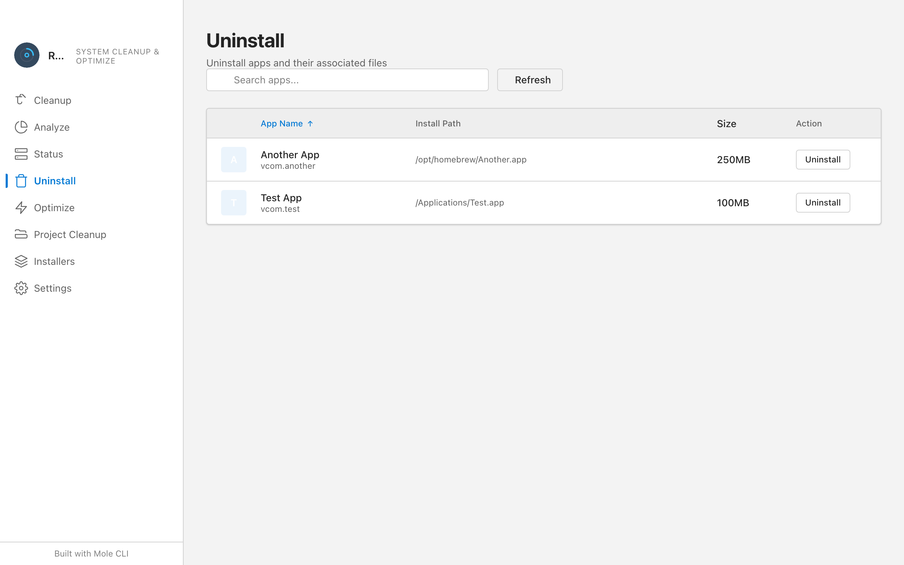 | 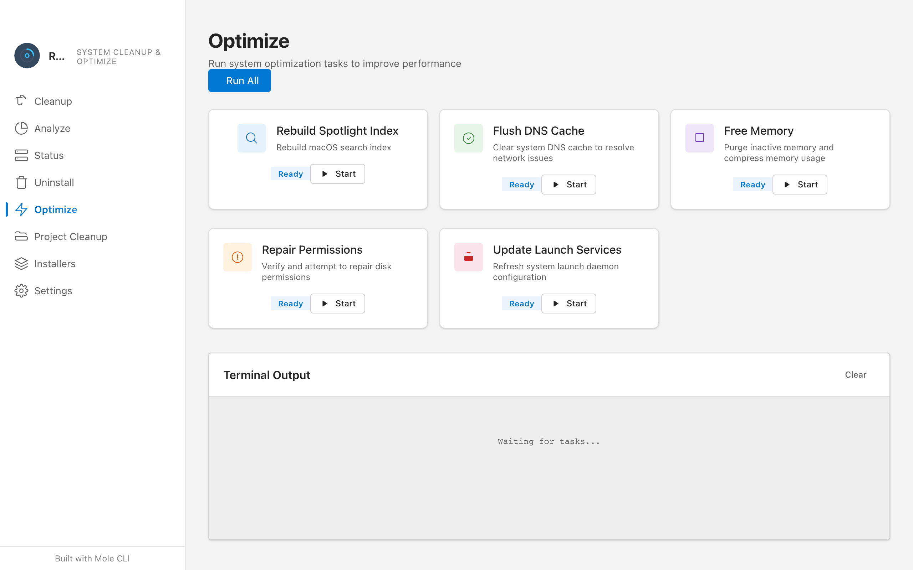 | 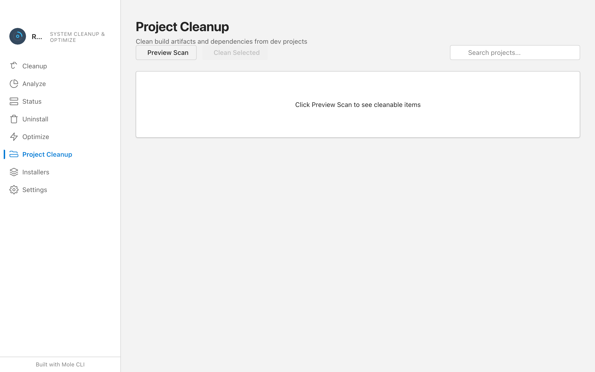 |

### Technology Stack

| Layer | Technology |
|-------|-----------|
| **Desktop Framework** | [Electron 42](https://www.electronjs.org/) (Node 24) |
| **UI Framework** | [Vue 3](https://vuejs.org/) (Composition API, `<script setup>`) |
| **Build Tool** | [Vite 8](https://vitejs.dev/) (Rolldown-powered, no `electron-vite`) |
| **Design Language** | Fluent Design — custom CSS variables (no `@fluentui/web-components`) |
| **Charting** | [ECharts 5](https://echarts.apache.org/) — interactive disk space visualizations |
| **i18n** | [vue-i18n](https://vue-i18n.intlify.dev/) — English & Chinese (detect + manual switch) |
| **Theme Engine** | Custom JSON-based theme system (light / dark / system follow) |
| **Testing** | [Vitest 4](https://vitest.dev/) (jsdom) + Browser Mode + [Playwright](https://playwright.dev/) E2E |
| **Linting / Formatting** | [oxlint](https://oxc.rs/) + [oxfmt](https://oxc.rs/) |

### Quality Assurance

The project maintains a **four-layer testing pyramid**:

| Layer | Tool | Scope | Command |
|-------|------|-------|---------|
| L1 Unit | Vitest (jsdom) | Pure functions, utilities, main process | `pnpm test` |
| L2 Component | Vitest (jsdom) | Vue component rendering, state changes | `pnpm test` |
| L3 Browser | Vitest Browser Mode | Complex interactions, ECharts, animations | `pnpm test:browser` |
| L4 E2E | Playwright + Electron | Cross-view navigation, IPC, window behavior | `pnpm test:e2e` |

CI (GitHub Actions) runs lint, format check, unit tests, and production build on every push.

### Important Notes

1. **First run**: Grant Full Disk Access permission (System Settings > Privacy & Security > Full Disk Access)
2. Some operations require admin privileges — macOS will prompt via a system dialog
3. Mole CLI (`mo`) must be available in your `PATH`
4. The app stores preferences in `localStorage` (theme, language, data source, auto-launch, etc.)
5. **Unsigned app**: macOS Gatekeeper will block the first launch. Run the following command to allow it:

   ```bash
   sudo xattr -rd com.apple.quarantine /Applications/Revel.app
   ```

### Contributors

<a href="https://github.com/a1121611810/revel/graphs/contributors">
  
</a>

### Related Links

- [Mole CLI](https://github.com/tw93/Mole) — the command-line tool that powers Revel
- [Fluent Design System](https://www.microsoft.com/design/fluent/) — Microsoft's design language
- [Electron](https://www.electronjs.org/) — cross-platform desktop framework
- [Vue 3](https://vuejs.org/) — progressive JavaScript framework

### License

MIT © [a1121611810](https://github.com/a1121611810). See [LICENSE](LICENSE) for details.

---

<a name="chinese"></a>

## 🇨🇳 中文

**Revel** 是 [Mole CLI](https://github.com/tw93/Mole) 的图形界面工具，采用 Microsoft **Fluent Design** 设计风格，使用 Vue 3 + Electron 构建。让 macOS 系统维护变得直观而美观 — 无需记忆命令，轻松完成清理、分析和优化。

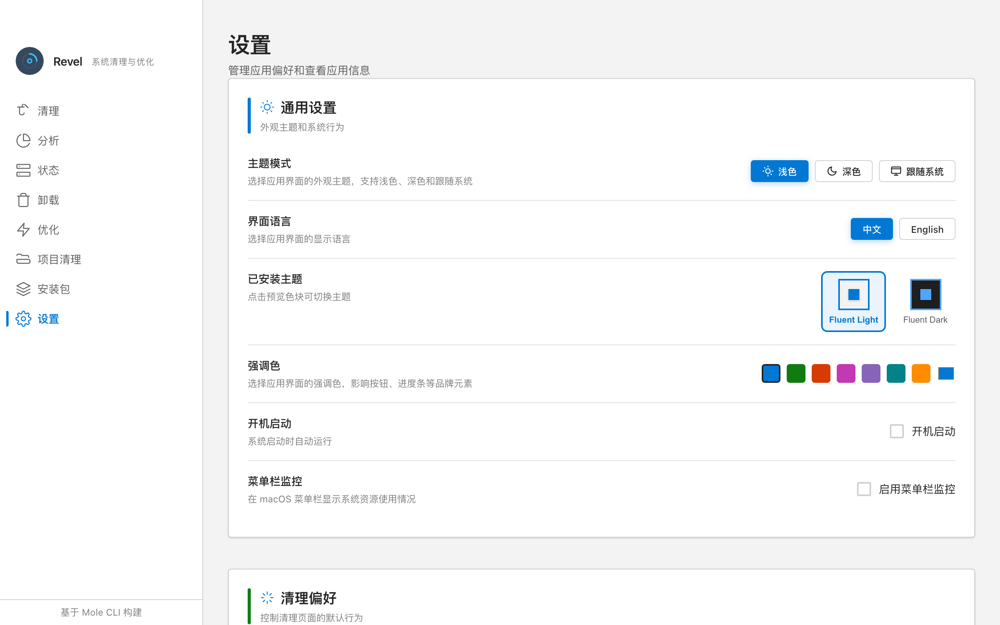

### 功能特性

| 模块 | 说明 | Mole 命令 |
|------|------|-----------|
| **清理** | 扫描并清理系统缓存、开发产物和临时文件 | `mo clean` |
| **分析** | 可视化磁盘空间分析（交互式饼图） | `mo analyze` |
| **状态** | 实时系统监控 — CPU、内存、磁盘、电池、网络、GPU | `mo status` |
| **卸载** | 卸载应用及关联文件 | `mo uninstall` |
| **优化** | 系统优化任务（DNS 刷新、内存清理、权限修复等） | `mo optimize` |
| **项目清理** | 清理开发项目的构建产物和依赖 | `mo purge` |
| **安装包** | 查找并删除下载的安装包（.dmg、.pkg） | `mo installer` |

### 前置要求

- **macOS** — Mole CLI 仅支持 macOS（Revel 有计划支持跨平台）
- **Node.js 18+** 和 **pnpm**（包管理器）
- **Mole CLI** 已安装：

  ```bash
  brew install tw93/tap/mole
  ```

### 快速开始

```bash
# 安装依赖
pnpm install

# 启动开发模式（Vite dev server + HMR + Electron）
pnpm dev

# 生产构建
pnpm build

# 打包 macOS 应用（DMG + ZIP）
pnpm build:mac
```

构建产物输出到 `dist/`，打包版本输出到 `release/`。

### 架构

```
主进程 (main.js)
├── 窗口管理 (BrowserWindow)
├── 系统托盘 (Tray)
├── IPC 通信 (ipcMain)
├── 命令执行 (child_process.spawn)
└── 权限提升 (osascript sudo)

渲染进程 (Vue 3 App)
├── 9 个视图页面（欢迎、清理、分析、状态…）
├── 自定义主题引擎 (themes/engine.js)
├── Fluent Design CSS 系统 (style.css)
└── 通过安全桥接调用 IPC (window.electronAPI)

预加载脚本 (preload.js)
└── 安全上下文桥接 (contextBridge)
```

项目使用**三个独立的 Vite 配置**，不依赖 `electron-vite` 封装：

- `vite.renderer.config.js` — 渲染进程开发服务器 + HMR
- `vite.main.config.js` — 主进程（库模式，CJS，Node 24）
- `vite.preload.config.js` — 预加载脚本（库模式，CJS）

### 功能截图

| 清理功能 | 磁盘分析 | 系统状态 |
|---------|---------|---------|
| 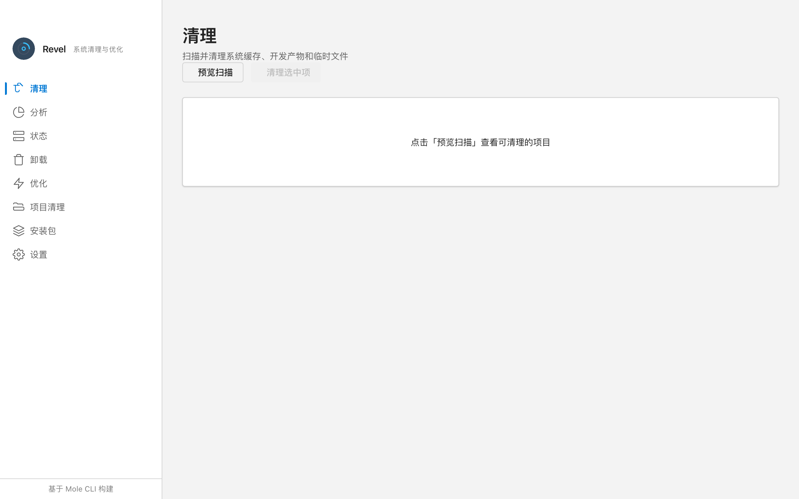 | 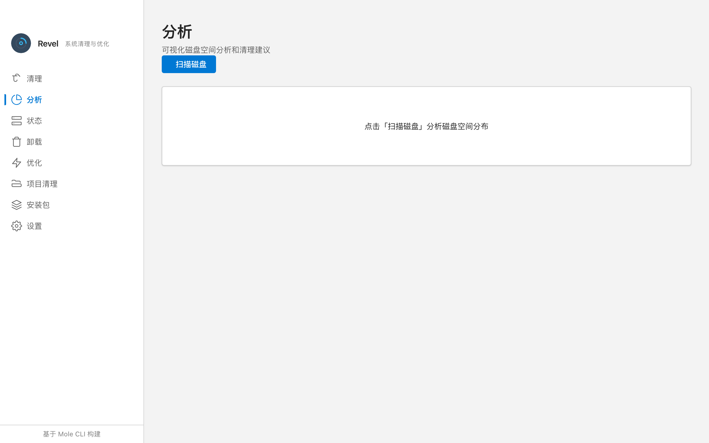 | 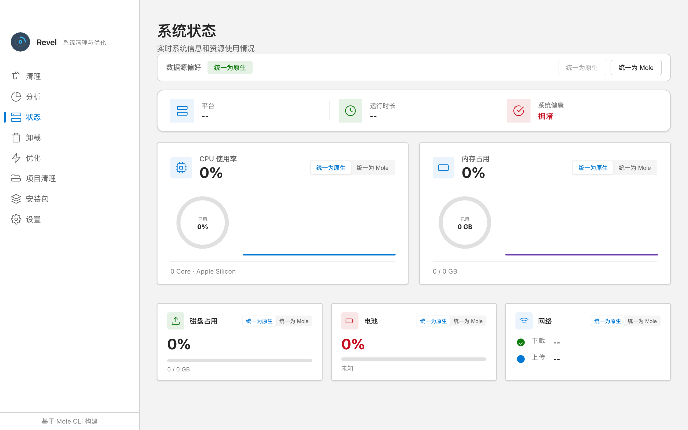 |
| 一键清理系统缓存 | 可视化磁盘空间分析 | 实时监控 CPU/内存/磁盘 |

| 应用卸载 | 系统优化 | 项目清理 |
|---------|---------|---------|
| 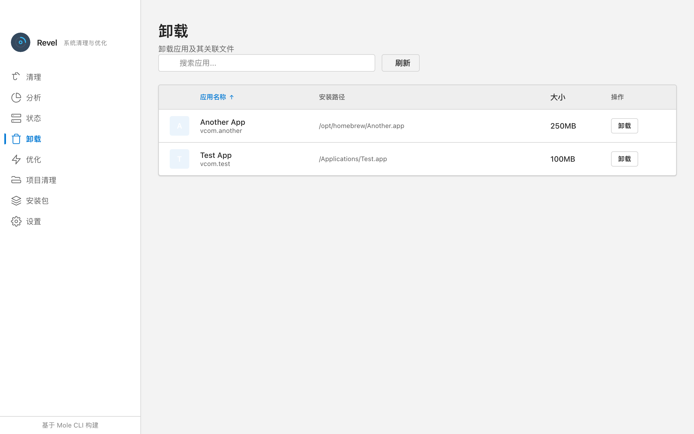 | 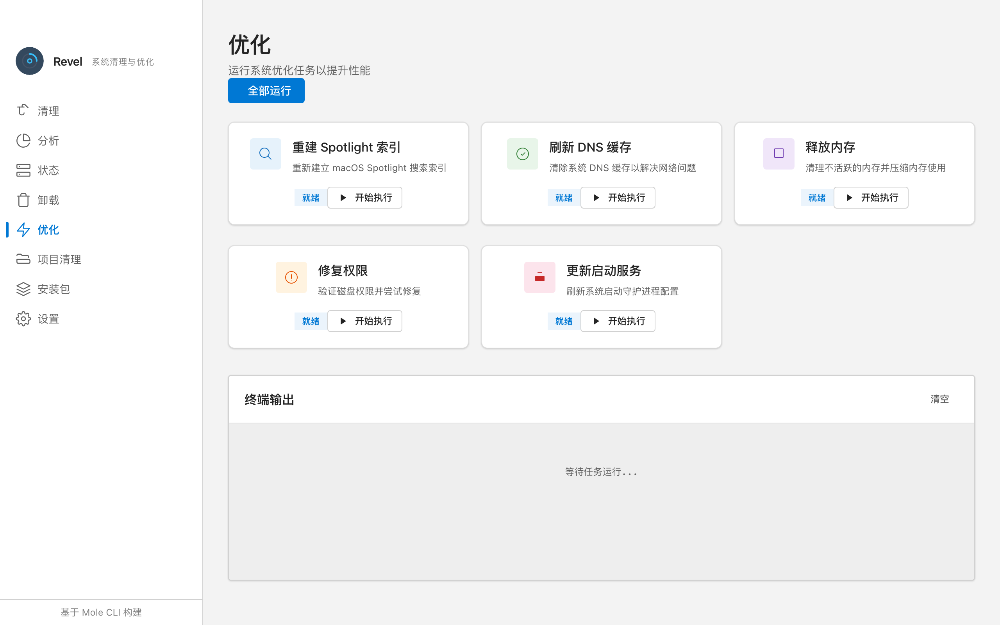 | 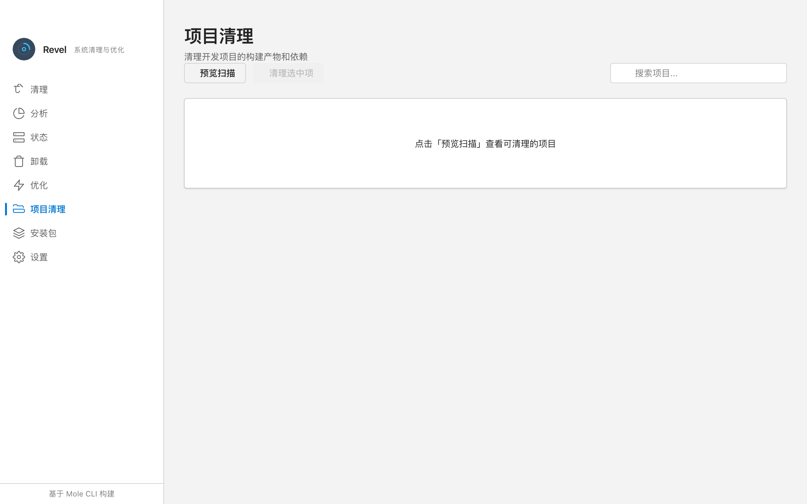 |

### 技术栈

| 层级 | 技术 |
|------|------|
| **桌面框架** | [Electron 42](https://www.electronjs.org/)（Node 24） |
| **UI 框架** | [Vue 3](https://vuejs.org/)（Composition API，`<script setup>`） |
| **构建工具** | [Vite 8](https://vitejs.dev/)（Rolldown 驱动，无 `electron-vite`） |
| **设计语言** | Fluent Design — 自定义 CSS 变量（不依赖 `@fluentui/web-components`） |
| **图表** | [ECharts 5](https://echarts.apache.org/) — 交互式磁盘空间可视化 |
| **国际化** | [vue-i18n](https://vue-i18n.intlify.dev/) — 中英文（自动检测 + 手动切换） |
| **主题引擎** | 自定义 JSON 主题系统（浅色 / 深色 / 跟随系统） |
| **测试** | [Vitest 4](https://vitest.dev/)（jsdom）+ 浏览器模式 + [Playwright](https://playwright.dev/) E2E |
| **代码检查 / 格式化** | [oxlint](https://oxc.rs/) + [oxfmt](https://oxc.rs/) |

### 质量保障

项目维护**四层测试体系**：

| 层级 | 工具 | 覆盖范围 | 命令 |
|------|------|----------|------|
| L1 单元 | Vitest (jsdom) | 纯函数、工具方法、主进程 | `pnpm test` |
| L2 组件 | Vitest (jsdom) | Vue 组件渲染、状态变化 | `pnpm test` |
| L3 浏览器 | Vitest Browser Mode | 复杂交互、ECharts、动画 | `pnpm test:browser` |
| L4 E2E | Playwright + Electron | 跨视图导航、IPC、窗口行为 | `pnpm test:e2e` |

CI（GitHub Actions）每次推送自动运行 lint、格式化检查、单元测试和生产构建。

### 注意事项

1. **首次运行**需要在 macOS 上授予完全磁盘访问权限（系统设置 > 隐私与安全性 > 完全磁盘访问权限）
2. 部分操作需要管理员权限，会通过 macOS 系统对话框请求授权
3. 确保 Mole CLI（`mo`）在 `PATH` 中可用
4. 应用偏好设置存储在 `localStorage`（主题、语言、数据源、开机启动等）
5. **未签名应用**：macOS 安全机制会阻止首次启动，需执行以下命令放行：

   ```bash
   sudo xattr -rd com.apple.quarantine /Applications/Revel.app
   ```

### 贡献者

<a href="https://github.com/a1121611810/revel/graphs/contributors">
  
</a>

### 相关链接

- [Mole CLI](https://github.com/tw93/Mole) — Revel 依赖的命令行工具
- [Fluent Design System](https://www.microsoft.com/design/fluent/) — Microsoft 设计语言
- [Electron](https://www.electronjs.org/) — 跨平台桌面框架
- [Vue 3](https://vuejs.org/) — 渐进式 JavaScript 框架

### 许可证

MIT © [a1121611810](https://github.com/a1121611810)。详见 [LICENSE](LICENSE)。

---

<p align="center">Built with ❤️ and Fluent Design</p>
